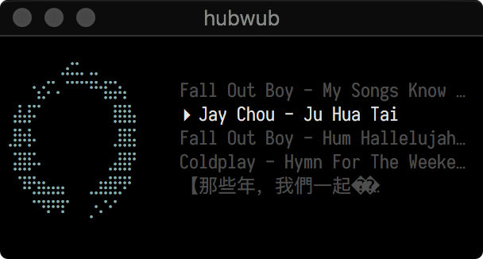
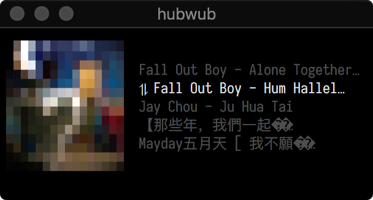

# hubwub

Very tiny music player for my needs. Mostly an excuse for me to learn how
to use termbox after being inspired by Brandon Rhode's [talk on terminal animations](https://www.youtube.com/watch?v=rrMnmLyYjU8).
Start it up in a directory where there are MP3 files, and `hubwub` will
do the rest:

    $ go get -u github.com/eugene-eeo/hubwub
    $ cd totally-legit-music
    $ hubwub

Ideally ran in a terminal with size 50x10 and with the excellent [Input Mono](http://input.fontbureau.com/)
font, although Envy Code R works as well. Note on OSX: for some reason images
are only properly displayed on screen-256 (at least for me). YMMV.

|    |   |
|:---------------------------------------:|:--------------------------------------:|
| Default art for MP3s without album art. | Album art and in Shuffle mode.         |

## controls

- `r` toggle repeat song/playlist
- `<space>` pause/play
- `s` shuffle queue
- `n` next track
- `p` prev track
- `q` quit

## todo

- [ ] less hacky way to display images
- [ ] consider using braille instead of unicode blocks
- [ ] ansi-parser + tcell?
