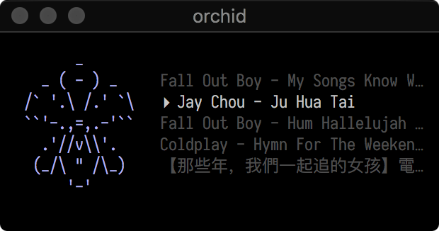
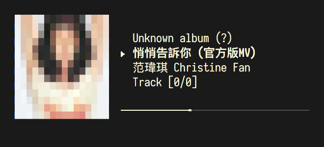
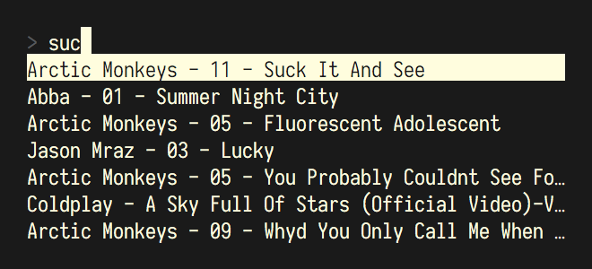
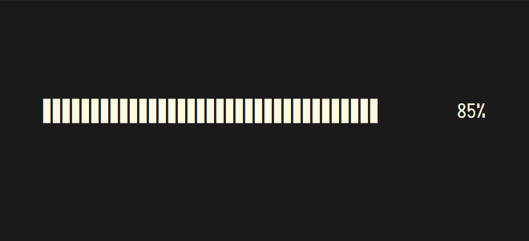

# orchid

> _“What does an orchid have to do with playing music? You sort of get tons of
> orchids in the jungle and they require very little water to live. You should
> name it after some musical instrument, but that's probably already taken.”_

Very tiny MP3 player for _my_ needs. Mostly an excuse for me to learn how
to use termbox (after being inspired by Brandon Rhode's [talk on terminal animations](https://youtu.be/rrMnmLyYjU8)),
as well as how to write my own UI loop. Start it up in a directory where
there are MP3 files, and `orchid` will do the rest:

    $ git clone https://github.com/eugene-eeo/orchid
    $ cd orchid
    $ make install
    $ cd totally-legit-music
    $ orchid -h

Ideally ran in a terminal with size 50x8; you could run it on something
larger, but it doesn't respond to larger/smaller sizes. You'll need a
terminal with true-colour support (see iTerm on OSX) for the album art
to display properly.

## screenshots

Screenshots are taken in iTerm with vertical and horizontal margin 15 and
title-less windows. Font used is 14px [Iosevka Term](https://github.com/be5invis/Iosevka) with the
[Twilight](https://github.com/mbadolato/iTerm2-Color-Schemes/blob/master/schemes/Twilight.itermcolors)
colour profile.

## controls

- `r` toggle repeat song/playlist
- `<left>` / `<right>` to adjust volume
- `<space>` pause/play
- `f` find mode
  - `<enter>` confirm selection
  - `<esc>` cancel
- `s` toggle shuffle mode
- `n` next track
- `p` prev track
- `q` quit
