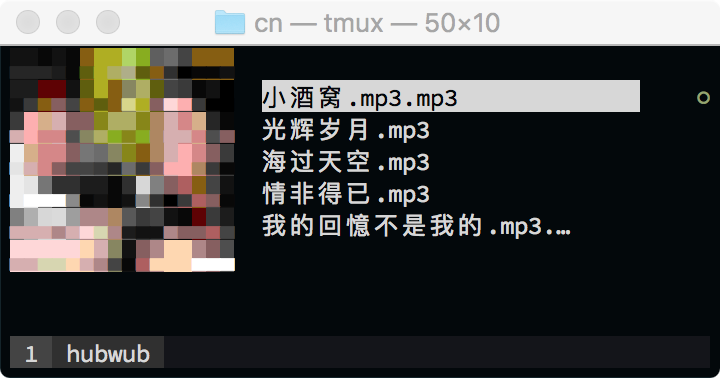

# hubwub

Very tiny music player for my needs. Start it up in a directory where there are
MP3 files, and `hubwub` will do the rest.

Ideally ran in a terminal with size 50x10 and with the Source Code Pro font,
although Envy Code R works as well. Note on OSX: for some reason images are
only properly displayed on tmux (for me). YMMV.

## controls

- `r` toggle repeat song/playlist
- `<space>` pause/play
- `n` next track
- `p` prev track
- `q` quit

## todo

- [ ] less hacky way to display images
- [ ] consider using braille instead of unicode blocks
- [ ] ansi-parser + tcell?
